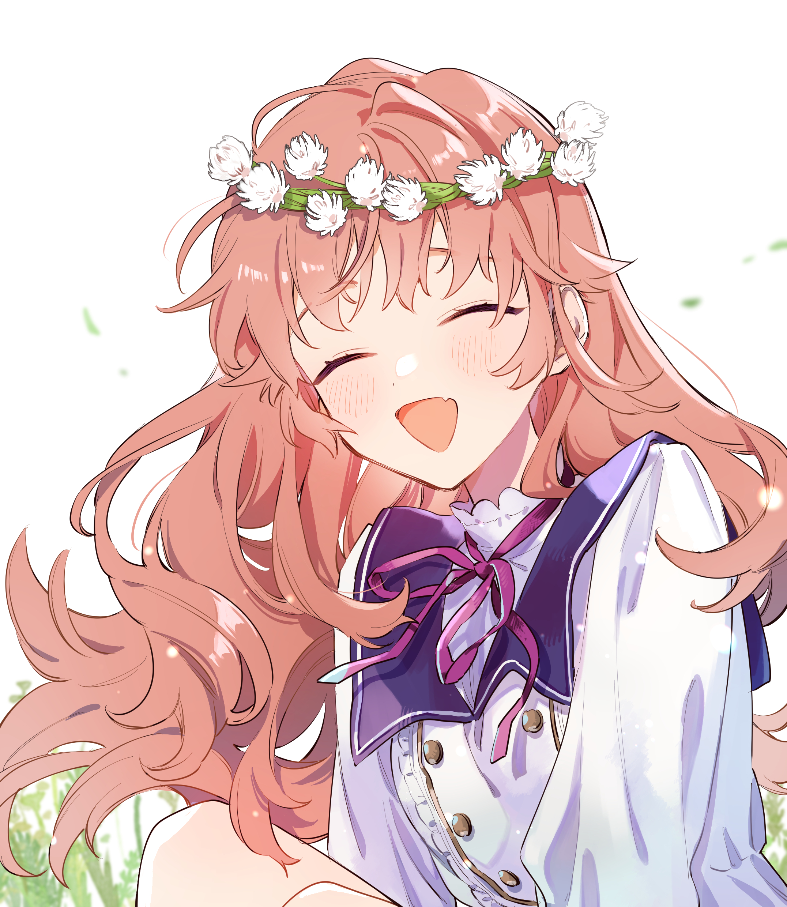
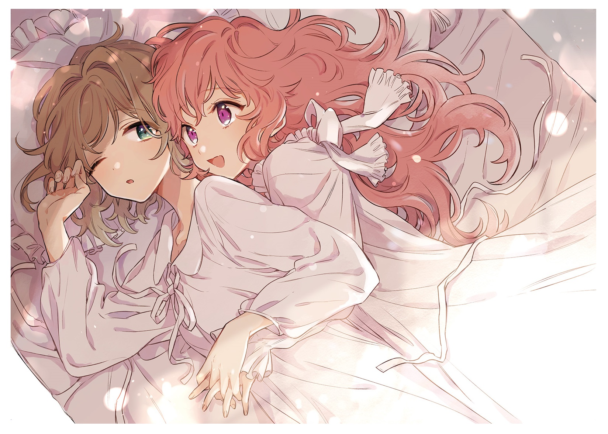
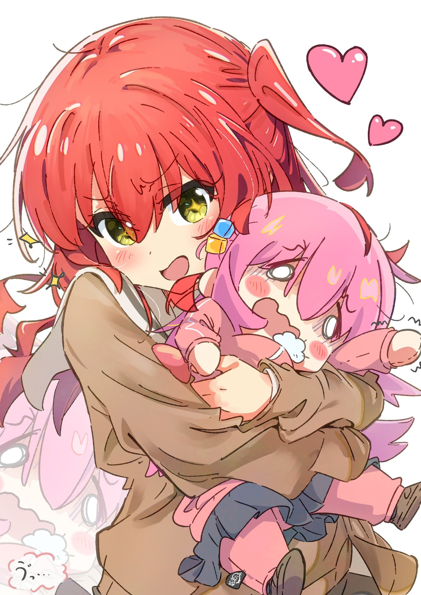
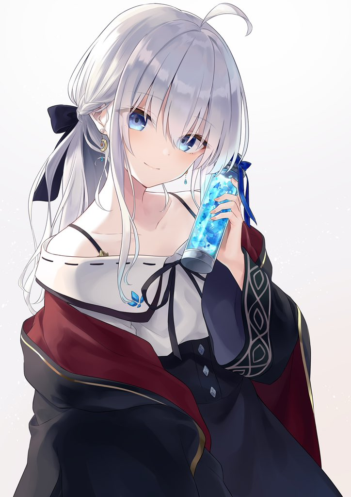

<h2>你好我是柠檬鱼蛋👋</h2>

很高兴你能看到这，鱼蛋是一只萌新，还请多多指教

<li>想成为优秀的前端</li>
<li>ACGN爱好者</li>
<li>音游菜鸟(悲)</li>
<li>很多东西还在学习中</li>

 
最后 
鱼蛋最喜欢大家了！❤️
 

    
some my loves

    
<table>
  <tr>
    <td width="50%">
      
    </td>
    <td width="50%">
      
    </td>
  </tr>
  <tr>
    <td width="50%">
      
    </td>
    <td width="50%">
      
    </td>
  </tr>
  <tr>
    <td width="50%">
      
    </td>
    <td width="50%">
      
    </td>
  </tr>
  <tr>
    <td width="50%">
      
    </td>
    <td width="50%">
      
    </td>
  </tr>
  <tr>
    <td colspan="2">
      
    </td>
  </tr>
</table>

<!--
**lfegg/lfegg** is a ✨ _special_ ✨ repository because its `README.md` (this file) appears on your GitHub profile.

Here are some ideas to get you started:

- 🔭 I’m currently working on ...
- 🌱 I’m currently learning ...
- 👯 I’m looking to collaborate on ...
- 🤔 I’m looking for help with ...
- 💬 Ask me about ...
- 📫 How to reach me: ...
- 😄 Pronouns: ...
- ⚡ Fun fact: ...
-->
